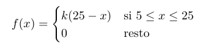

  
## Descuentos
  
Una empresa de servicios de Internet quiere hacer una campaña para aplicar entre un 5% y un 25% de
descuento a sus clientes de forma aleatoria y lineal, y entonces la probabilidad de que un cliente reciba un
determinado descuento se puede modelizar mediante la siguiente función de densidad:



Responde a las siguientes cuestiones:
1. Calcula *k* para que *f(x)* sea realmente una funcion de densidad
```{r, warning=FALSE}

```
2. Calcula la probabilidad de que un cliente obtenga más de un 20% de descuento
```{r, warning=FALSE}

```
3. ¿Cuál es el descuento medio que se espera aplicar?
```{r, warning=FALSE}

```
4. Calcula la varianza de la variable aleatoria
```{r, warning=FALSE}

```
5. ¿Entre qué valores estarán probablemente la mitad de los descuentos realizados?
```{r, warning=FALSE}

```
6. ¿Cuál es la moda de la variable aleatoria?
```{r, warning=FALSE}

```
7. Calcula la mediana de la variable aleatoria
```{r, warning=FALSE}

```
